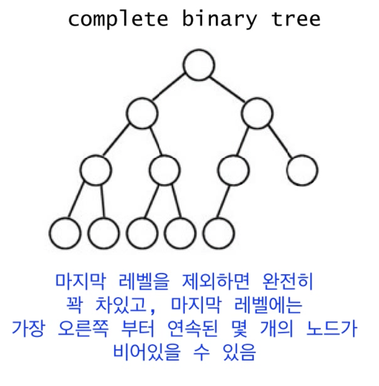
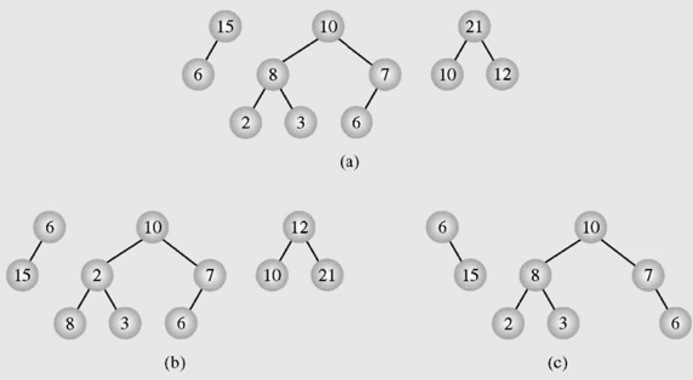
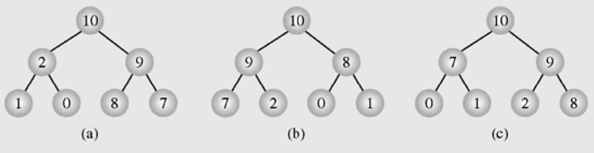
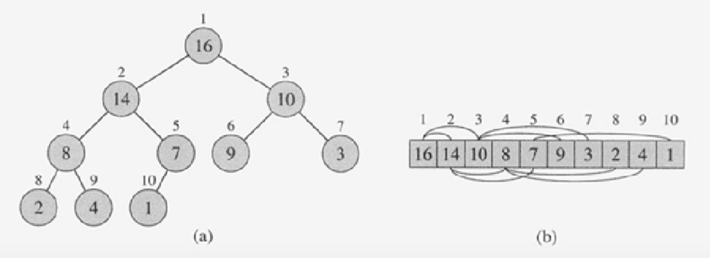
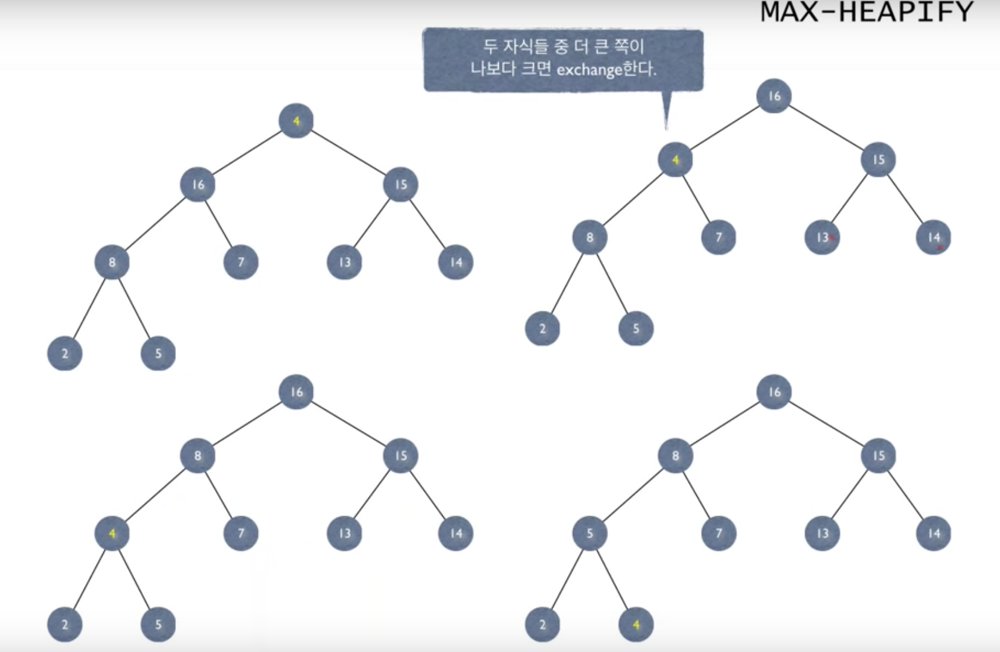

# Heap Sort
- 힙을 설명한다.
- 힙 정렬을 설명한다.
- 힙 정렬을 구현한다.
- 힙 정렬의 시간복잡도와 공간 복잡도를 설명한다. 

### 힙이란?
1. 완전 이진 트리의 일종(Complete binary tree) 으로 `우선순위 큐`를 위하여 만들어진 자료구조이다.
2. `Complete binary tree`를 만족하면서 `Heap Property`를 만족하는 자료구조.
3. `Heap`은 일차원 배열로 표현이 가능하다.

### 힙 정렬이란?
- `Heap` 자료구조를 이용하여, `Heapify`연산을 통해 정렬하는 방법.

#### 2. Complete binary tree

- 만약 오른쪽부터 노드가 연속적으로 비어지지 않았다면 `Complete binary tree`가 아니다.

 

- A는 `Heap`이고 B,C는 `Heap`이 아니다.
- A는 `Complete binary tree`를 만족하면서 `Max Heap`을 만족한다.
- B는 `Complete binary tree`를 만족하지만 `Max Heap`, `Min Heap` 두 `Heap Property`중 하나라도 만족하지 않는다.
- C는 `Complete binary tree`를 만족하지 않고 `Max Heap`을 만족한다.

 

- A, B, C는 동일한 데이터를 가진 서로 다른 힙이다.
- 데이터가 동일하다고해서 동일 모양의 트리가 만들어 진다고 보장할 수 없다. **힙은 유일하지 않다.**

#### 2. Heap Property
- `Heap Property`는 두 종류가 있다.
    - Max Heap Property (Max Heap) : 부모는 자식보다 크거나 같다. key(부모 노드) >= key(자식 노드)
    - Min Heap Property (Min Heap) : 부모는 자식보다 작거나 같다. key(부모 노드) <= key(자식 노드)
    - 둘 중에 하나만 만족하면 되며, 최대값을 찾을때는 `Max Heap`을, 최소값을 찾을때는 `Min Heap`을 다룬다.

#### 3. 힙은 일차원 배열로 표현이 가능하다.
     
- 구현을 위해 0번째 index는 사용하지 않는다. arr[1....n]
- 왼쪽 그림처럼 부모 노드부터 레벨 순서대로 왼->오 순으로 첫번째 인덱스부터 배열을 만든다.
- 루트 노드 : arr[1]
- arr[i]의 부모 노드 : arr[i / 2]                                           
- 부모 노드 arr[i]의 왼쪽 자식 노드 : arr[2 * i]                                           
- 부모 노드 arr[i]의 오른쪽 자식 노드 : arr[2 * i + 1]
                                          
#### Heapify
     
- 힙을 만족하도록 하는 연산을 `Heapify`라고 한다.
- 루트 노드만 `Heap Property`를 만족하지 않고 자식 노드들의 왼쪽, 오른쪽 Subtree가 `Heap`을 만족하면
두 Subtree의 루트 노드중 현재 루트 노드와 값을 exchange하는 과정을 반복하여 이 과정을 교체할 노드가 없을때까지 하는 연산이다.
    - Max-heafify : 두 Subtree의 루트 노드 중 큰 값과 교환.
    - Min-heafify : 두 Subtree의 루트 노드 중 작은 값과 교환.

### 힙 정렬의 시간 복잡도
- 트리 높이에 비례하므로 시간 복잡도 : O(logN)
- 새로운 공간할당이 없으므로 공간 복잡도 : O(1)