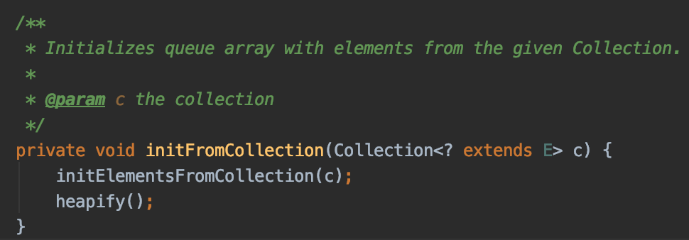
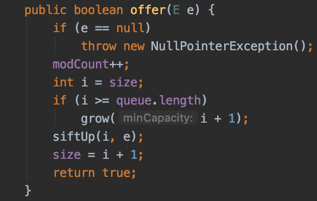

# 우선순위 큐
- 우선순위 큐는 들어간 순서에 상관 없이 우선순위가 높은 데이터가 먼저 나온다.
- 일반적인 큐는 FIFO로써 선형적인 형태를 가지지만, 우선순위 큐는 기본으로 `Heap`으로 구현되어 있다.

```java
class A {
    public static void main(String[] args){
        PriorityQueue priority = new PriorityQueue<>(Collections.reverseOrder());  
    }
}
```


- `Heap property`처럼 우선순위 큐도 2가지 종류가 있다.
    1. 최대 우선순위 큐 : 우선순위가 높은 값부터 출력을 하며 2가지 연산을 지원하는 자료구조
    2. 최소 우선순위 큐 : 우선순위가 낮은 값부터 출력을 하며 2가지 연산을 지원하는 자료구조
- Insert 연산 : 새로운 원소를 삽입한다. 다만 `Heap`에 노드 추가시 위치는 마지막 노드에 추가되고, `Heap`에 따른 Root Node 까지 shift up 연산이 발생한다.
    
    - 시간 복잡도 : O(logN) : 트리의 레벨에 비례하면서 수행
    - Sudo code
    <pre>
        <code>maxHeapInsert(arr, data) {</code>
        <code>    heapSize = heapSize + 1</code>
        <code>    arr[heapSize] = data // 마지막 노드에 insert된 데이터</code>
        <code>    insertedNodeIndex = heapSize // maxHeapify를 위해 index를 가져온다.</code>
        <code>    // lastChildNode는 루트 노드가 아니고, 부모노드 값보다 작을때까지 스왑</code>
        <code>    while (insertedNodeIndex != rootNodeIndex && arr[getParentIndex(insertedNodeIndex)] < arr[insertedNodeIndex]) {</code>
        <code>        swap(insertedNodeIndex, getParentIndex(insertedNodeIndex))</code>
        <code>        insertedNodeIndex = getParentIndex(insertedNodeIndex)</code>
        <code>    }</code>
        <code>}</code>
    </pre>

- Extract 연산 : 힙으로부터 최대/최솟값을 삭제하고 반환
    - `Heap`에서 최대값은 항상 Root에 존재하지만(부모는 자식보다 같거나 커야함) 루트 노드 삭제시 노드의 갯수가 줄어들기 때문에 삭제시 완전 이진 트리를 유지하기가 힘들어진다.
    - 완전 이진 트리를 유지하기 위해 
        1. Root값을 dequeue하고
        2. 마지막 노드 데이터값을 복사해 루트 노드로 옮기고
        3. Root Node 대신 마지막 노드를 삭제한다.
        4. 루트로 올라간 값을 `heap property`에 맞게 `heapify` 연산 수행
    - 시간 복잡도 : O(logN) : 트리의 레벨에 비례하면서 수행
    - Sudo code
        <pre>
            <code>extractMax(arr) {</code>
            <code>    if heapSize < 1 then throw error underflow</code>
            <code>    max = rootNodeValue</code>
            <code>    root = arr[heapSize]</code>
            <code>    heapSize--</code>
            <code>    heapify(arr, rootNodeIndex)</code>
            <code>    return max</code>
            <code>}</code>
        </pre>
 
