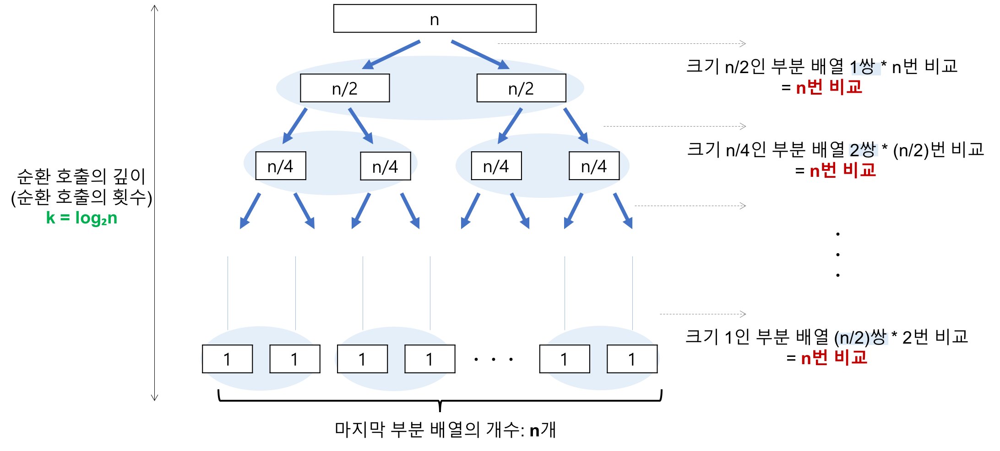

# Quick Sort
- 퀵 정렬을 설명한다.
- 퀵 정렬을 구현한다.
- 퀵 정렬의 평균시간복잡도와 최악시간복잡도를 설명한다. 

### 퀵 정렬 설명
- Quick Sort 역시 Divide and Conquer 전략을 사용하여 Sorting 이 이루어진다.
- Merge Sort와 달리 Quick Sort는 배열을 비균등하게 분할한다. 
- Divide 과정에서 pivot 이라는 개념이 사용된다. 
- 이 pivot 을 기준으로 좌측은 pivot 으로 설정된 값보다 작은 값이 위치하고, 우측은 큰 값이 위치하도록 partition 된다. 
- 이렇게 나뉜 좌, 우측 각각의 배열을 다시 재귀적으로 Quick Sort 를 시켜 계속 partition 과정을 적용하면서 정렬하는 방법이다.

### 퀵 정렬 평균시간복잡도
- partition 과정에서 반 반씩 나뉘게 되는 경우 즉, 균형 잡힌 분할을 잡혔을 경우
- T(n) = 2T(N/2) + N = O(N logN)

### 퀵 정렬 최악시간복잡도
- 피벗 값이 최소나 최대값으로 지정되어 피벗을 제외한 파티션 한쪽은 0개 한쪽은 n-1개로 분할된 경우.
- n개의 데이터에 대해서 (n-1)번 +(n-2)번 + (n-3)번 + ... + 1 식으로 비교횟수가 2(n-1)/2만큼 수행 된다.
- O(n^2)

### 퀵 정렬 공간 복잡도
- 주어진 배열 안에서 swap을 통해, 정렬이 수행되므로 O(n)

### 피벗값은 랜덤하게
- 현실 데이터는 랜덤하지 않으므로 정렬된 데이터 or 역정렬된 데이터가 들어올 수 있어서 첫번째, 마지막으로 하는 방법은 피하는 것이 좋다.
- 피봇을 랜덤하게 선택하면 입력에 관계없이 일정한 수준의 성능을 얻을 수 있다. 또 악의적인 입력에 대해 성능 저하를 막을 수 있다.

### 퀵 정렬 문제점
- 정렬된 배열에 대해서는 Quick Sort의 불균형 분할에 의해 오히려 수행시간이 더 많이 걸릴 수 있다.
- 재귀로 할 경우 배열이 아주 클 경우 Stack Overflow 발생할 수 있다. 비재귀 방법으로 해결한다.
