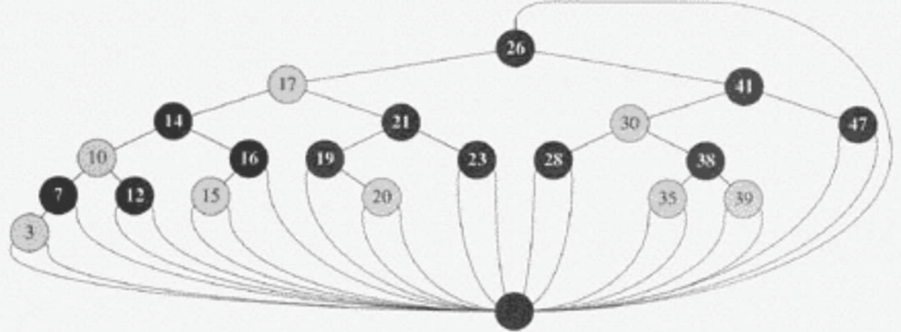
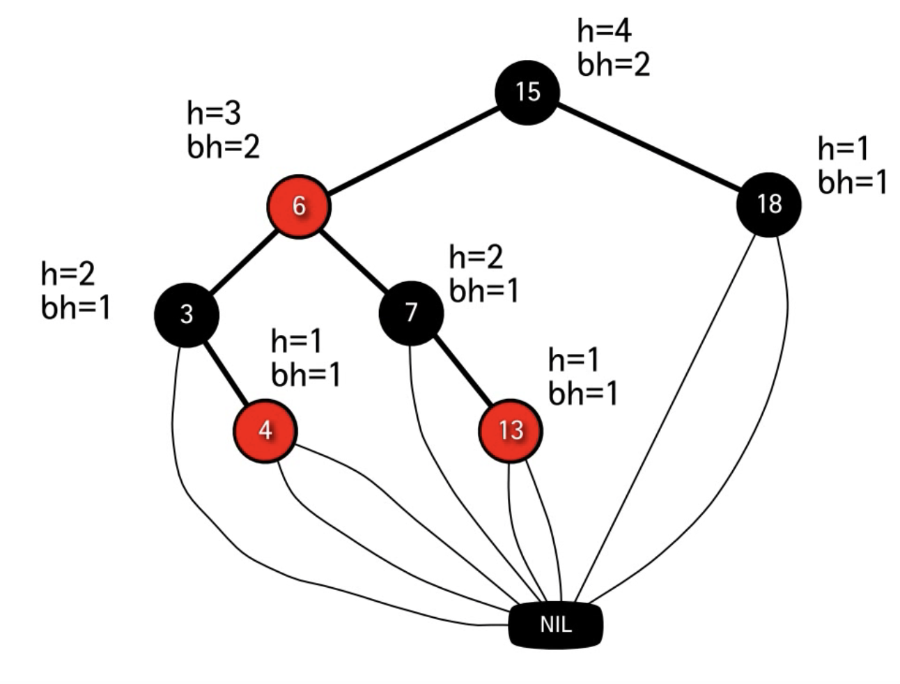
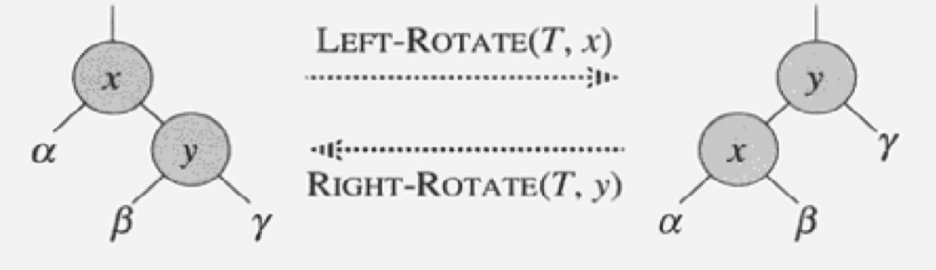

# 레드 - 블랙 트리
- BST의 3가지 기본연산은 트리 높이에 비례하는데, 최악일 경우 O(N)
- 현실에서 정렬된 데이터가 insert가 되면 최악의 경우에 해당할 가능성이 높다.
- BST의 기본 특징은 유지하면서 Tree의 밸런스가 무너지지 않도록 확장한 트리가 RBT 트리이다.
- 균형잡힌 트리 (Balanced)라고 불리며, 높이가 O(logN)
    - 최악의 경우라도 O(logN)
    - 다만 insert, delete 연산이 복잡해지는 단점이 있다.
- RBT의 노드는 데이터, left, right, parent 주소 참조를 가진다.
- **특이하게 RBT는 자식 노드가 존재하지 않으면 null을 가지는게 아닌 `NIL 노드`라는 툭수노드를 가진다고 가정한다.**
    - **따라서 모든 리프 노드들은 `NIL 노드` 이다.**
- 루트의 부모 노드도 null이 아닌 `NIL 노드`를 가진다고 가정한다.
- 즉, 실제 노드(내부 노드라고도 함)와 `NIL 노드`를 가진다.
    - 설명을 편하게 하기 위한 가상 노드이며 실제 구현을 위한 노드가 아니다. <br>


<br>

## 1. RBT의 조건
- 다음 5가지 조건을 만족하는 BST이다.
1. 각 노드들은 Red or Black 이다.
2. 루트 노드는 항상 반드시 Black이다.
3. 모든 리프 노드(`NIL 노드`)는 Black이다.
4. **Red 노드는 연속해서 등장할 수 없다.**
    - Red 노드의 자식 or 부모는 Black이여야 한다.
    - 부모 - 자식이 Black은 허용한다.
5. **모든 노드에 대해서 어떤 노드로부터 자손인 리프 노드(`NIL 노드`)에 이르기까지 <br>
    모든 경로는 동일한 갯수의 Black 노드가 존재한다.**
<br>

<br>

## 2. RBT의 높이
1. 노드 X의 높이는 자신으로부터 리프 노드(NIL 노드)까지 가장 긴 경로에 포함된 엣지의 갯수
    - 여러 경로가 존재할 경우 그 중 경로의 **최댓값이 높이가 된다.**
2. 노드 X의 블랙-높이는 자신으로부터 리프 노드까지의 경로상에 있는 Black 노드의 갯수이다. (자기자신 포함 X) (NIL 노드 포함 O)
    - 블랙-높이는 자신으로부터 어느 경로로 가든 똑같다. 왜? => RBT 특징 5. <br>
       > 노드 자신으로부터 리프 노드까지에 이르는 모든 경로는 동일한 갯수의 Black 노드가 존재.

3. 높이가 h인 노드의 블랙-높이는 높이의 절반 이상이다.
    - bh(x) >= h(x) / 2
    - RBT 특징 4. <br>
        > Red 노드는 연속해서 등장할 수 없다.

4. 노드 X를 루트로 하는 임의의 서브트리는 **최소 2<sup>bh(x) - 1</sup> - 1**개의 내부 노드를 포함한다. (수학적 귀납법 증명)
    - bh(x) == 0이라면, 노드 X는 NIL 노드라는 뜻. 노드 X를 루트를 하는 서브 트리의 내부 노드 갯수는 최소 2<sup>bh(x)</sup> - 1 = 2<sup>0</sup> - 1 = 0개의 내부 노드를 가진다 (성립)
        ```
            (NIL)
        ```
    - bh(x) == 1이라면, 노드 X자기 자신을 제외한 블랙 노드 갯수가 1개가 있다는 뜻으로, NIL 노드를 가진다. 노드 X를 루트를 하는 서브 트리의 내부 노드 갯수는 최소 2<sup>bh(x)</sup> - 1 = 2<sup>1</sup> - 1 = 1개의 자기 자신 내부 노드를 가진다 (성립)
        ```
            (X)
            /
         (NIL)
        ```
    - bh(x) == 2이라면, 노드 X자기 자신을 제외한 블랙 노드 갯수가 2개가 있다는 뜻으로, 
        ```
                  (X)
                /     \
           (black A) (black B) 
            /   \      /   \     
                
                  ...
        ```
        - X의 두 자식 노드 A,B가 있고 각 자식노드의 블랙-트리 높이는 bh(X)-1이 된다. <br>
                  A의 bh(A)는 2<sup>bh(X) - 1</sup> - 1 <br>
                  B의 bh(B)는 2<sup>bh(X) - 1</sup> - 1 <br>
        - 따라서 X를 루트로 하는 서브트리는 2 * (2<sup>bh(X) - 1</sup> - 1) + 1(X) = 2<sup>2</sup> - 1 = 3개의 내부 노드를 가진다 (성립)
5. 위의 두 3,4번 특징으로 설명 가능한 것은 n개의 내부노드를 가지는 레드블랙트리의 높이는 2log(n+1) 이하이다.
    - n >= 2<sup>bh</sup> - 1 >= 2<sup>h/2</sup> - 1 이므로, 여기서 bh와 h는 각각 루트 노드의 블랙-높이와 높이
    - n >= 2<sup>h/2</sup> - 1  
    - n + 1 >= 2<sup>h/2</sup>
    - log(N+1) >= h/2
    - 2log(N+1) >= h

## 3. 회전
- search 연산은 BST와 같다.
- insert, delete 연산을 알기전에 회전 연산을 배워야 한다.
- 회전은 한 노드를 중심으로 부분적으로 노드의 모양을 수정하는 것.
- 시간 복잡도 : O(1)


<br>

- **회전 연산을 하고나서도 BST의 특징을 유지한다.**
    - α는 원래 x보다 작음, LR연산 후에도 α는 x보다 작음 
    - γ는 원래 y보다 큼, LR연산 후에도 γ는 y보다 큼
    - β는 원래 x보다 크고 y보다 작음, LR연산 후에도 β는 x보다 크고 y보다 작음

- pseudo
    - x.right가 NIL NODE가 아니라고 가정
    - rootNode의 부모도 NIL NODE가 아니라고 가정
```
leftRotate(tree, node) {
    // 01
    y = x.right; // x의 오른쪽 자식 노드를 y에 저장한다.
    x.right = y.left // x의 오른쪽 자식노드를 β로 만든다.

    // 02
    y.left.parent = x; // β의 부모 노드를 x로, y와의 연결 제거
    y.parent = x.parent // y의 부모노드를 현재 x의 부모 노드로

    // 03
    if (x.parent instanceof NIL_NODE) { // x가 루트노드라면
        tree.rootNode = y;
    } else if (x == x.parent.left) { // x의 부모노드가 존재하고 x가 부모노드의 왼쪽 자식이였다면
        x.parent.left = y; // y가 x부모노드의 왼쪽 자식노드가 된다.
    } else {
        x.parent.right =y; // 그렇지 않다면, y는 x의 부모노드의 오른쪽 자식이 된다.
    }
    
    // 04
    y.left = x;    // x가 y의 왼쪽 자식이 되고
    x.parent = y; // y가 x의 부모노드가 된다.
}

01.
         x                                x   
       /    \                            /  \  
      α      y            --------->    α    \    y  
            / \                               \ /   \
           β   γ                               β     γ

02.       parent                            parent
          /                                 /   |
         x                                x     |
       /  \                              /  \   | 
      α    \    y         --------->    α    β  y
            \ /   \                              \
             β     γ                              γ

03.       parent                            parent
          /   |                             /      
         x    |                            y        x
       /  \   |           --------->        \      /  \
      α    β  y                              γ    α    β
               \
                γ  

04.      parent                            parent
         /                                 /
        y        x        --------->      y
         \      /  \                    /  \
          γ    α    β                  x    γ 
                                      /   \
                                     α     β 
```


                  
