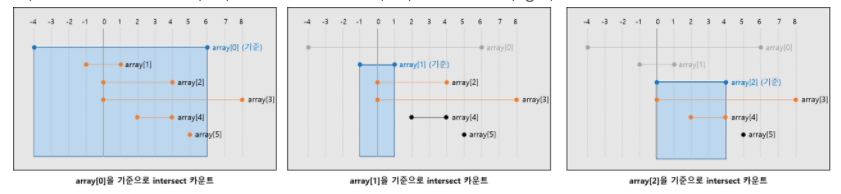

# NumberOfDiscIntersections 풀이 해석


- 이 문제는 문제 자체를 이해하느라 오래걸렸다.
- 디스크의 쌍을 구하는 문제이다.
- 기존 예제는 아래와 같이 쌍으로 묶일 수 있다.

```
0th and 1st
0th and 2nd
0th and 4th
1st and 2nd
1st and 3rd
1st and 4th
1st and 5th
2nd and 3rd
2nd and 4th
3rd and 4th
4th and 5th
```

### 첫번쨰 풀이



- 출처 : https://miiingo.tistory.com/326

1. 왼쪽 끝점을 기준으로 정렬한 후
2. 비교하는 원의 왼쪽 끝점은 기준 원의 왼쪽 끝점 과 기준 원의 오른쪽 끝점 사이에 있으면 교차 한 것
3. 비교하는 원의 왼쪽 끝점이 기준 원의 오른쪽 끝점보다 크면 겹치지 않음 (왼쪽 끝점 기준으로 정렬했기에 그 이후 원들도 겹치지않음)

- 시간복잡도는 O(N^2)이 나와 퍼포먼스에서 통과하질 못함.

### 두번째 풀이

- 인터넷을 참고해서 재풀이

1. 양 끝점인 left와 right 각각 분리
2. left, right를 배열에 각각 담고 오름차순으로 정렬

- 각 배열을 오름차순으로 정렬하고 조건이 `rights[i] >= lefts[j]`인 이유는 다음과 같다.
- 현재 기준 원의 right 보다 비교하는 원의 left가 작다면 현재 기준 원에 겹친다.
- right[0] = 1일 때, (디스크 A)
    - 1보다 작은 left는 다음과 같다. {-4, -1, 0, 0}
    - 이 4개의 원은 right[0]과 겹치게 되어있다.
    - 왜냐하면 1보다 작은 right가 존재하지 않기에 {-4, -1, 0, 0}가 왼쪽점인 원은 최소 right가 1이므로 <br>
      겹치는 것을 파악할 수 있다.
    - 여기서 {-4, -1, 0, 0} 중 1개는 right[0]이 1인 원을 포함한다. 그래서 right[0]을 빼준다.
    - 그러면 right[0]과 겹치는 녀석들은 4 - 1 = **3개**이다.
- right[1] = 4일 때, (디스크 B)
    - 4보다 작거나 같은 값을 가지는 left는 {-4, -1, 0, 0, 2} 이다.
    - 여기서 겹치지 않는 녀석은 이전 right 값이 1인 녀석이다. 이녀석을 제거해준다.
        - 왜냐하면 right[0]일 때 (A, B) 쌍으로 묶였다.
        - 지금은 right[1]일 때 (B, A) 쌍이기 때문에 중복되는 쌍이기에 제거해준다.
    - 그리고 자기 자신을 빼준다.
    - 그러면 right[1]과 겹치는 녀셕들은 5 - 2 = **3개**이다.
- right[2] = 4일 때
    - 위와 같은 원리로 5 - 3 = **2개**
- right[3] = 5일 때
    - left는 {-4, -1, 0, 0, 2, 5} 6개이다.
    - 여기서 right[0, 1, 2] + 자기 자신을 빼준다.
    - 6 - 4 = **2개**
- right[4] = 6일 때
    - left는 {-4, -1, 0, 0, 2, 5} 6개이다.
    - 여기서 right[0, 1, 2, 3] + 자기 자신을 빼준다.
    - 6 - 5 = **1개**
- right[5] = 8일 때
    - left는 {-4, -1, 0, 0, 2, 5} 6개이다.
    - 여기서 right[0, 1, 2, 3, 4] + 자기 자신을 빼준다.
    - 6 - 6 = 0개
- 이리하여 총 3 + 3 + 2 + 2 + 1 = 11개가 나온다.
     

