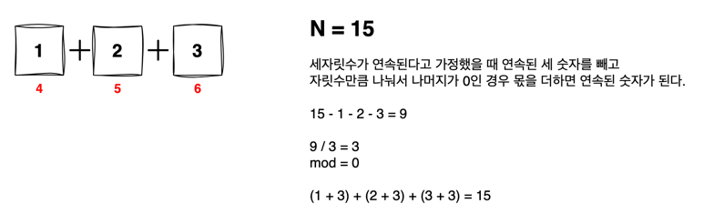

# 연속된 자연수의 합

양의 정수 N (7 <= N < 1000) 이 입력되면 2개 이상의 연속된 자연수의 합으로 정수 N을 표현하는 방법의 가짓수를 출력하라

만약 N이 15이면
```
7 8
4 5 6
1 2 3 4 5
```
총 3가지이다


- 이 방법은 두가지 풀이방법이 있다.

## 1. 투포인터
- 투포인터로 left ~ right 사이의 값(sum)이 15인지 체크하면서
- sum 값이 만약 크다면 left를 움직이면서 sum -= left 
- sum 값이 만약 작다면 right를 움직이면서 체크한다.


## 2. 수학적인 접근
- 이 문제는 1부터 연속되는 숫자를 빼고 연속되는 숫자의 갯수만큼 나눴을 때 나머지가 존재하는지 파악하면 된다.

<br>
  
- [1, 2] 두개일 때 


<br>

- [1, 2, 3] 3개일때



<br>

- [1, 2, 3, 4] 4개일 때
- 나누어 떨어지지 않기 때문에 연속된 숫자가 되지 못한다.


<br>

- [1, 2, 3, 4, 5] 5개 일 때 숫자를 빼면 0이 되므로 최대 연속된 숫자의 갯수는 5개까지이다.


